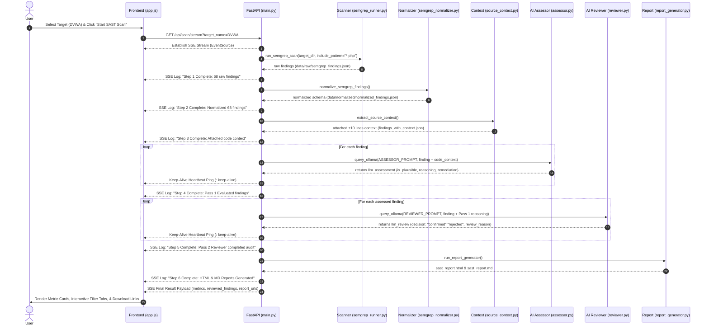
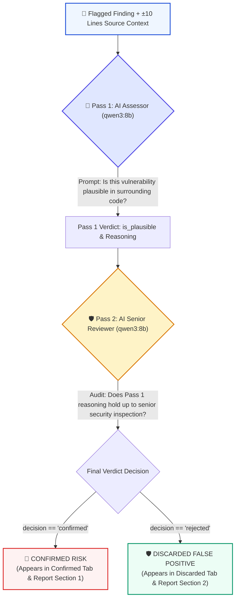
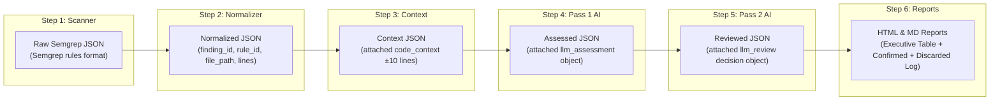

# 🎨 CCPL Web SAST Code & Data Flow Architecture Diagrams

This document provides visual diagrams and detailed data-flow maps to help developers and reviewers understand the inner workings of the CCPL Web SAST pipeline.

---

## 1. 🔄 Complete End-to-End System Sequence Diagram

This sequence diagram shows how a scan request triggered on the **Frontend Web UI** flows through the **FastAPI Orchestrator**, executes each pipeline step, streams real-time logs via Server-Sent Events (SSE), and renders final results.

---

## 2. 🧠 2-Pass Dual-Agent AI Reasoning Architecture

This flowchart illustrates how **Pass 1 AI Assessor** and **Pass 2 AI Senior Reviewer** work together to eliminate false positives.

---

## 3. 📊 Step-by-Step Data Transformation Pipeline

This diagram shows how data schema transforms at every milestone step in the project.

---

## 💡 Quick Reference Summary for Presentations

| Step | Module File | Input | Main Function | Output |
| :--- | :--- | :--- | :--- | :--- |
| **1. Scanner** | `scanners/semgrep_runner.py` | Target Directory (`targets/DVWA`) | Runs Semgrep CLI with `*.php` filter | `data/raw/semgrep_findings.json` |
| **2. Normalizer** | `parsers/semgrep_normalizer.py` | Raw Semgrep JSON | Maps rules to unified schema | `data/normalized/normalized_findings.json` |
| **3. Context** | `parsers/source_context.py` | Normalized JSON | Reads surrounding ±10 lines of source code | `data/normalized/findings_with_context.json` |
| **4. Assessor** | `llm/assessor.py` | Context JSON | Prompts Qwen3 8B for initial plausibility | `data/normalized/assessed_findings.json` |
| **5. Reviewer** | `llm/reviewer.py` | Assessed JSON | Audits Pass 1 verdict for FP elimination | `data/normalized/reviewed_findings.json` |
| **6. Reports** | `reports/report_generator.py` | Reviewed JSON | Generates standalone HTML & MD reports | `reports/sast_report.html` & `.md` |
| **Server** | `main.py` | Web API Request | FastAPI SSE log streaming & orchestrator | Real-Time Log Stream to Browser |
