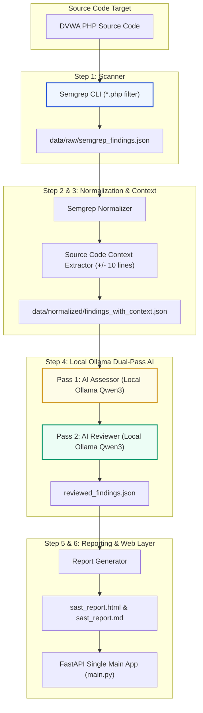
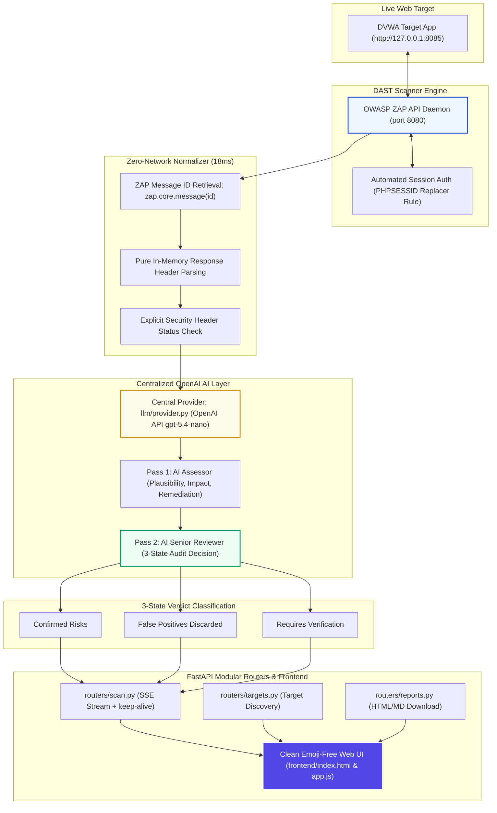

# 📊 CCPL SAST & DAST Architecture & Flowchart Diagrams

This document contains visual Mermaid architecture diagrams and pipeline flowcharts for both Phase 1 and Phase 2. These diagrams render automatically on GitHub.

---

## 🛡️ 1. Phase 1 Architecture (Web SAST & Local Ollama Prototype)

---

## 🌐 2. Phase 2 Architecture (Web DAST + OpenAI Provider + Zero-Network Normalization)

---

## 🎨 3. Editable Architecture File
The source editable diagram file **`docs/08_Editable_Architecture.drawio`** and graphics **`architecture diagram.png`** / **`flow chart.png`** are preserved in the `docs/` folder for editing in Draw.io.
