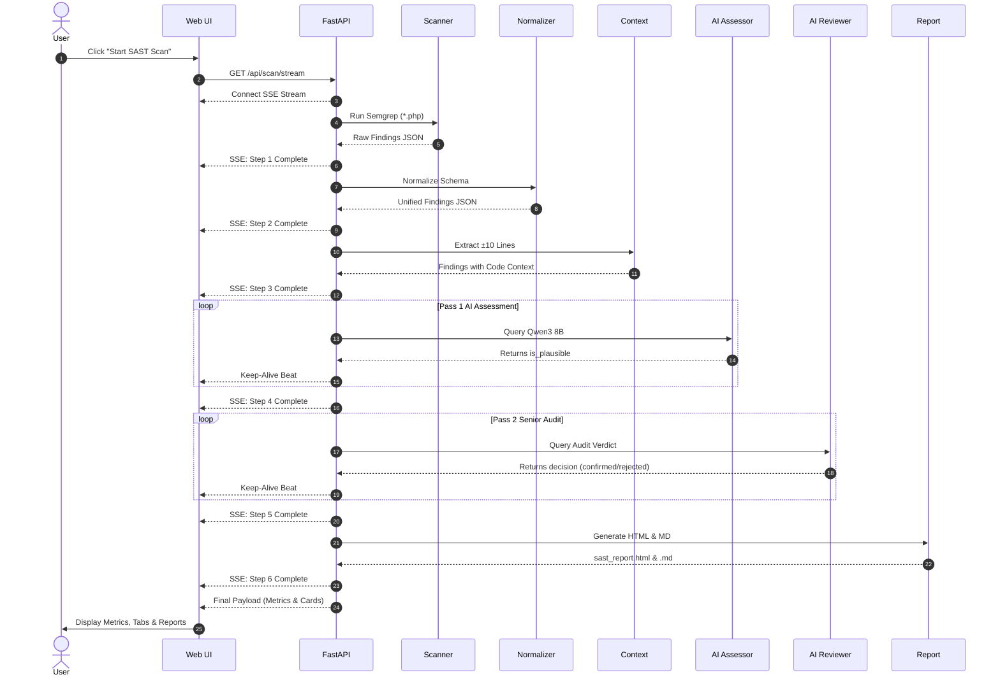
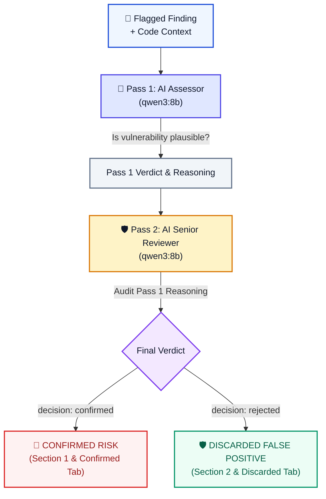
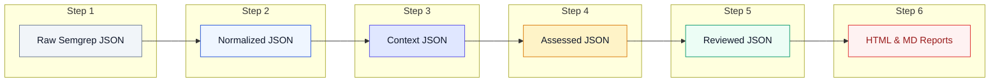

# 🎨 CCPL Web SAST Architecture & Data Flow Diagrams

This document provides visual diagrams to help developers and reviewers understand the CCPL Web SAST pipeline.

---

## 1. 🔄 System Sequence Diagram

---

## 2. 🧠 2-Pass Dual-Agent AI Reasoning Flowchart

---

## 3. 📊 Step-by-Step Data Transformation Pipeline

---

## 💡 Quick Reference Summary

| Step | Module File | Main Function | Purpose |
| :--- | :--- | :--- | :--- |
| **1. Scanner** | `scanners/semgrep_runner.py` | `run_semgrep_scan()` | Runs Semgrep CLI on `targets/DVWA` (`*.php`) |
| **2. Normalizer** | `parsers/semgrep_normalizer.py` | `normalize_semgrep_findings()` | Maps raw Semgrep rules to clean JSON schema |
| **3. Context** | `parsers/source_context.py` | `extract_source_context()` | Extracts ±10 lines of surrounding code |
| **4. Assessor** | `llm/assessor.py` | `run_llm_assessor()` | Prompts Qwen3 8B for initial plausibility |
| **5. Reviewer** | `llm/reviewer.py` | `run_llm_reviewer()` | Audits Pass 1 verdict for FP elimination |
| **6. Reports** | `reports/report_generator.py` | `run_report_generator()` | Generates standalone HTML & MD reports |
| **Server** | `main.py` | `stream_sast_scan()` | FastAPI SSE log streaming & orchestrator |
