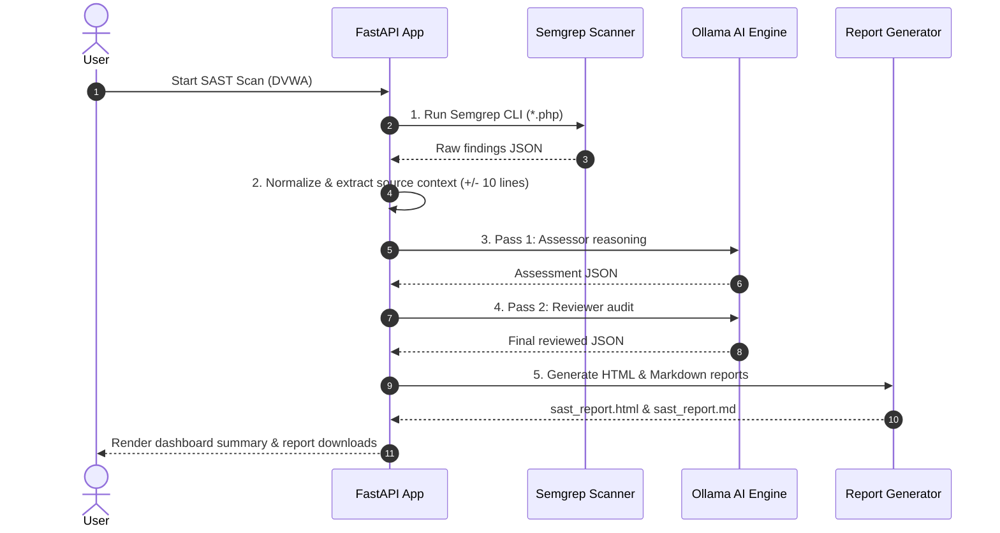
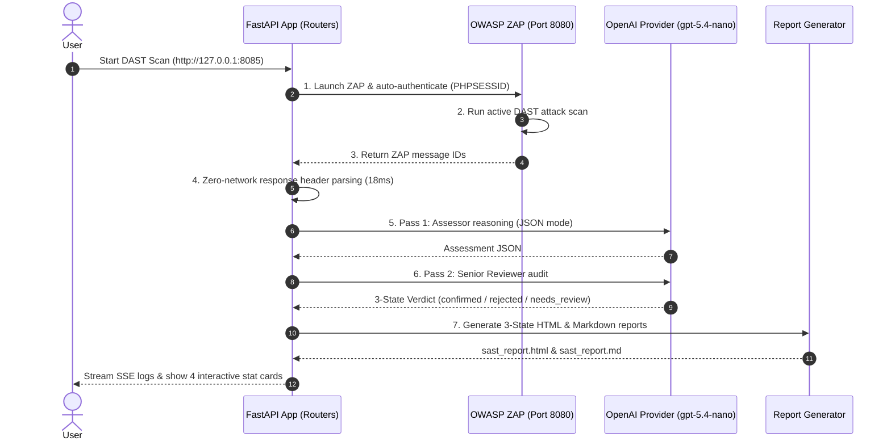

# 🔄 CCPL SAST & DAST Execution Flow Diagrams

Compact, ultra-readable execution sequence diagrams for Phase 1 and Phase 2.

---

## 🛡️ Phase 1 Sequence Diagram (Web SAST)

---

## 🌐 Phase 2 Sequence Diagram (Web DAST)

