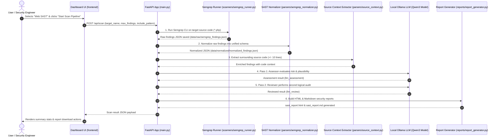
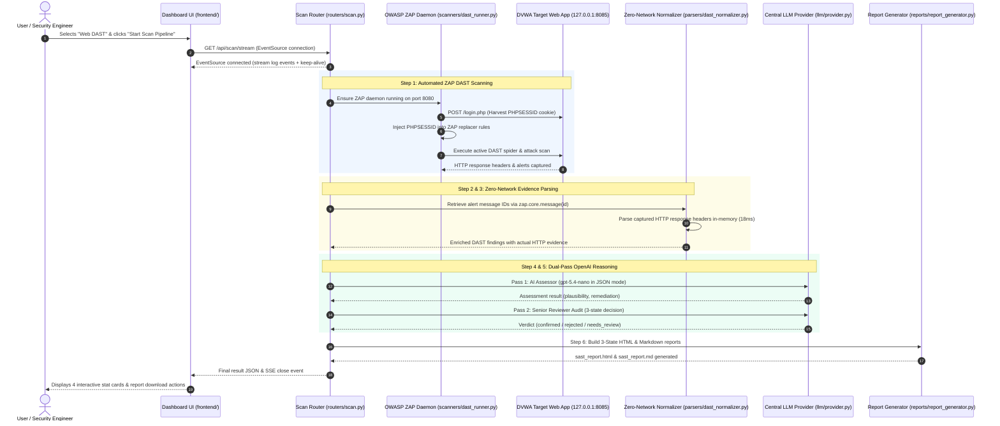

# 🔄 CCPL SAST & DAST Phase-Wise Execution Sequence Diagrams

This document contains step-by-step Mermaid sequence diagrams showing the exact execution flow for Phase 1 and Phase 2. These render natively on GitHub.

---

## 🛡️ 1. Phase 1 Execution Sequence Diagram (Web SAST & Local Ollama)

Shows how a Web SAST scan executes step-by-step from trigger to HTML report generation.

---

## 🌐 2. Phase 2 Execution Sequence Diagram (Web DAST + ZAP + OpenAI API + Routers)

Shows how a Web DAST scan executes step-by-step with 0-network-call ZAP evidence parsing, central OpenAI provider, and real-time SSE log streaming.

