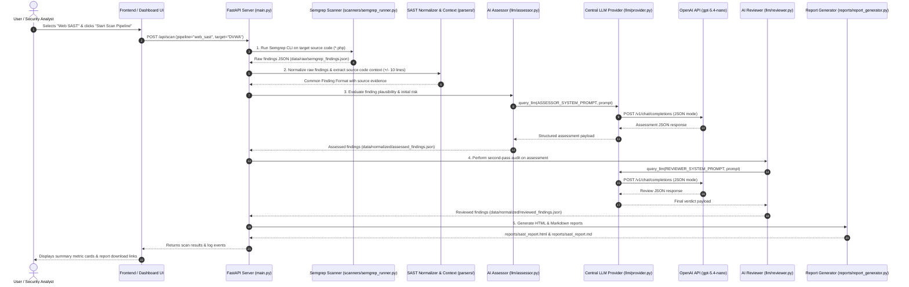
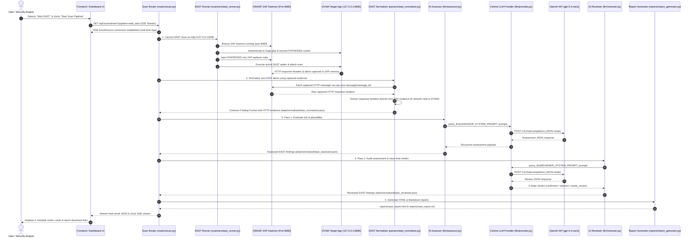

# 🔄 CCPL SAST & DAST Pipeline Sequence Diagrams

This document contains step-by-step Mermaid sequence diagrams illustrating the end-to-end execution flow for both Phase 1 (Web SAST) and Phase 2 (Web DAST). These diagrams render natively on GitHub.

---

## 🛡️ 1. Phase 1 Sequence Diagram: Web SAST Pipeline

Shows the static code analysis execution flow from user trigger on the frontend dashboard to report generation.

*Historical Note*: Phase 1 initial prototyping used local Ollama (`qwen3:8b`) before the AI provider communication was decoupled into `llm/provider.py` and connected to OpenAI API (`gpt-5.4-nano`) in Phase 2.

---

## 🌐 2. Phase 2 Sequence Diagram: Web DAST Pipeline

Shows the dynamic HTTP security testing flow, highlighting zero-secondary-network evidence extraction from OWASP ZAP, central LLM provider query, 3-state verdict auditing, and real-time SSE streaming.

---

## 📌 Architectural Summary of Key Points

1. **Frontend Layer Integration**: The User interacts exclusively with `Frontend / Dashboard UI` (`frontend/index.html` & `app.js`), which communicates with the backend `FastAPI Server` via REST endpoints (`/api/scan`) and EventSource streams (`/api/scan/stream`).
2. **Zero Secondary Network Requests**: The DAST normalizer retrieves HTTP response headers directly from ZAP's captured evidence (`zap.core.message(id)`). It does NOT issue secondary HTTP requests (`requests.get()` / `requests.head()`) to the target application.
3. **Common Finding Format**: Both SAST and DAST findings are converted into a unified JSON finding structure before entering the AI pipeline:
   - **SAST Evidence**: Source code context snippet (`code_context`).
   - **DAST Evidence**: HTTP request/response header context (`evidence_context`).
4. **Centralized LLM Provider**: Both `llm/assessor.py` (Pass 1) and `llm/reviewer.py` (Pass 2) query `llm/provider.py` (`query_llm()`), which manages communication with OpenAI API (`gpt-5.4-nano`).
5. **Report Artifact Paths**: Generated report files are saved to `reports/sast_report.html` and `reports/sast_report.md`, which are served via `routers/reports.py`.
